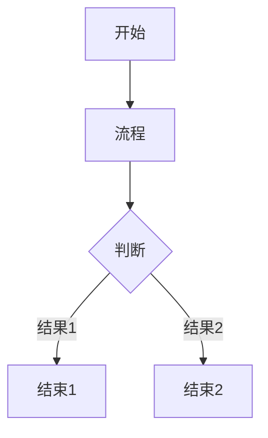

Title:   CrossDown示例
Summary: 够简洁的了
Authors: CrossDark
Date:    __date__
base_url: http://crossdark.net:3000/crossdark/CrossDown

[TOC]

# CrossDown
自制的markdown,添加了一些自定义的语法
效果请见[README.html](https://github.com/CrossDark/CrossDown/blob/main/README.html)

1 基本语法

1.1 标题

# 一级标题
## 二级标题
### 三级标题
#### 四级标题
##### 五级标题
###### 六级标题

1.2 样式

1.2.1 *斜体*

1.2.2 **粗体**

1.2.3 ***粗斜体***

1.2.4 ~下划线~

1.2.5 ~~删除线~~

1.2.6 ==高亮==

1.2.7 [在文本的正上方添加一行小文本]^(主要用于标拼音)

1.2.8 [在指定的文本里面隐藏一段文本]-(只有鼠标放在上面才会显示隐藏文本)

1.2.9 分割线

---
___
***

1.3 链接

1.3.1 普通链接

[链接文本](链接地址)

[CrossDark](https://crossdark.com)

<https://crossdark.net/>

1.3.2 图片


1.3.3 变量链接

[链接文本][变量]

[变量]: https://crossdark.com

2 缩写

2.1 定义

*[缩写]: 长的文本

2.2 赋值

直接在文本中使用 缩写 即可

3 锚点

3.1 定义

{#锚点名}

3.2 页内链接

{锚点名}

4 代码块

4.1 `单行`

4.1.1 LaTex

这是`$CO_2$`二氧化碳

这是`$H_2O$`水

`$\lg\left(\frac{目标生物的理智值}{稳定折磨型工具人的理智值}\right)$`

4.1.2 函数

`¥y=x*2+1¥`  // 不定义范围

`¥y=x**2¥€-50,50€`  // 定义了x范围

`¥y=x**3¥€-50,50|-100,100€`  // 定义了y范围

4.1.3 强调

`{强调文本}`

`{强调变量}`

4.2 多行

4.2.1 YAML

```yaml
A:
    1. a
    2. b
    3. c
B:
    - a
    - b
    - c
```

4.2.2 Python

```python
def main():
    print('CrossDown')
```

4.2.3 Mermaid



4.2.4 shell

```shell
cd ../..
```

5 转义

\\ 

\a 

\*

6 引用

> 一级引用
>> 二级引用
>>> 三级引用
>>>> 四级引用
>>>>> 五级引用
>>>>>> 六级引用
> 
> 引文内添加*斜体***粗体**~下划线~~~删除线~~==高亮==

7 提纲

7.1 提纲号

以数字和点组成,通过空格与提纲名分隔,例如:

7.1.1 提纲号示例

点不能出现在开头或结尾,例如

.7.1.2 错误示范

7.1.3. 错误示范

不能出现两个及以上连续的点,例如:

7..1...4 错误示范

提纲号会被自动配置为锚点,可直接使用{7}{7.1}

8 注释

8.1 强注释

|=
无论如何都会被移除
`放在代码块里也没用`
=|

8.2 弱注释

<!-- 这是注释 -->

只有在 // 后面才会被移除

`// 代码中的注释弱不会被移除`

9 列表

9.1 有序列表

1. a
2. b
3. c
4. d

9.2 无序列表

- A
- B
- C
- D

10 表格

| 表头1  | 表头2  | 表头3  |  
|:----:|:----:|:----:|  
| 单元格1 | 单元格2 | 单元格3 |  
| 单元格4 | 单元格5 | 单元格6 |

11 警告

!!! warning "警告标题"
    警告内容

12 Emoji

:person_biking:

这是一个笑脸:grinning_face_with_big_eyes:图案

13 脚注

13.1 使用

这是一个[^脚注]

13.2 定义

[^脚注]: 一段长的文本用于说明

13.3 放置

通过一下代码可以将文章中所有的脚注定义集中于一处

///Footnotes Go Here///

否则所有定义将被集中在文章末尾

14 外框

14.1 警告

这是一个!!!警告!!!……

!!!
这是一条警告
!!!

14.2 提醒

这是一个!-!提醒!-!……

!-!
这是一条提醒
!-!

14.3 安心

这是一个,,,安心,,,……

,,,
这是一条安心
,,,

14.4 怀疑

这是一个,-,怀疑,-,……

,-,
这是一条怀疑
,-,

15 内部链接

[[Bracketed]]
