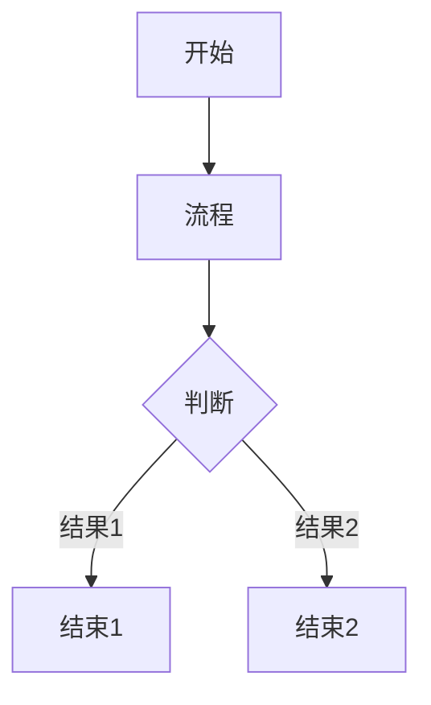

Title:   CrossDown示例
Summary: 够简洁的了
Authors: CrossDark
Date:    __date__
base_url: http://crossdark.net:3000/crossdark/CrossDown

[TOC]

# CrossDown
自制的markdown,添加了一些自定义的语法
效果请见<README.html>

1 基本语法

1.1 标题

# 一级标题
## 二级标题
### 三级标题
#### 四级标题
##### 五级标题
###### 六级标题

1.2 样式

1.2.1 *斜体*

1.2.2 **粗体**

1.2.3 ***粗斜体***

1.2.4 ~下标~

1.2.5 ~~删除线~~

1.2.6 ==高亮==

1.2.7 [在文本的正上方添加一行小文本]^(主要用于标拼音)

1.2.8 [在指定的文本里面隐藏一段文本]-(只有鼠标放在上面才会显示隐藏文本)

1.2.9 分割线

---
___
***

1.2.10 ^上标^

1.2.11 ^^下划线^^

1.3 链接

1.3.1 普通链接

[链接文本](链接地址)

[CrossDark](https://crossdark.com)

<https://crossdark.net/>

1.3.2 图片


1.3.3 变量链接

[链接文本][变量]

[变量]: https://crossdark.com

2 缩写

2.1 定义

*[缩写]: 长的文本

2.2 赋值

直接在文本中使用 缩写 即可

3 锚点

3.1 定义

{{#锚点名}}

3.2 页内链接

{{锚点名}}

4 代码块

4.1 `单行`

Here is some code: `#!py3 import pymdownx; pymdownx.__version__`.

The mock shebang will be treated like text here: ` #!js var test = 0; `.

4.1.1 LaTex

这是$CO_2$二氧化碳,或者可以写成这样CO~2~

这是$H_2O$水,或者写成H~2~O
H^3^~2~O

$\lg\left(\frac{目标生物的理智值}{稳定折磨型工具人的理智值}\right)$

4.1.2 函数

`¥y=x*2+1¥`  // 不定义范围

`¥y=x**2¥€-50,50€`  // 定义了x范围

`¥y=x**3¥€-50,50|-100,100€`  // 定义了y范围

4.1.3 按键风格

++ctrl+alt+delete++

4.2 多行

4.2.1 YAML

```yaml {hl_lines="1 3" linenums="2"}
A:
    1. a
    2. b
    3. c
B:
    - a
    - b
    - c
{[强调变量]}:
    - a
    - b
```

4.2.2 Python

```python {linenums="1"}
#! usr/bin/python3.11
def main():
    print('CrossDown')
```

4.2.3 Mermaid



4.2.4 shell

```shell
cd ../..
ls
```

4.2.5 latex

$$
E(\mathbf{v}, \mathbf{h}) = -\sum_{i,j}w_{ij}v_i h_j - \sum_i b_i v_i - \sum_j c_j h_j
$$

\[3 < 4\]

\begin{align}
    p(v_i=1|\mathbf{h}) & = \sigma\left(\sum_j w_{ij}h_j + b_i\right) \\
    p(h_j=1|\mathbf{v}) & = \sigma\left(\sum_i w_{ij}v_i + c_j\right)
\end{align}

行内公式: $p(x|y) = \frac{p(y|x)p(x)}{p(y)}$ 

4.2.6 HTML

```html
<head>
    <!--头部-->
</head>
<body>
    <h1>标题</h1>
</body>
```

4.2.7 未知语言

```
#! usr/bin/python3.11
def main():
    print('CrossDown')
```

5 转义

\\ 

\a 

\*

6 引用

> 一级引用
>> 二级引用
>>> 三级引用
>>>> 四级引用
>>>>> 五级引用
>>>>>> 六级引用
> 
> 引文内添加*斜体***粗体**~~删除线~~==高亮== ^上标^ ~下标~ ^^下划线^^ ++ctrl+alt+delete++ (c) :smile:

7 提纲

7.1 提纲号

以数字和点组成,通过空格与提纲名分隔,例如:

7.1.1 提纲号示例

点不能出现在开头或结尾,例如

.7.1.2 错误示范

7.1.3. 错误示范

不能出现两个及以上连续的点,例如:

7..1...4 错误示范

提纲号会被自动配置为锚点,可直接使用{{7}}{{7.1}}

8 注释

<!-- 这是注释 -->

<!--
可以多行
-->

9 列表

9.1 有序列表

1. a
2. b
3. c
4. d

9.2 无序列表

- A
- B
- C
- D

9.3 释义列表

A
:   1. a  
    2. b  
    3. c  
  
B
:   - a  
    - b  
    - c

`{强调变量}`
:   - a
    - b
    - c

Apple
:   Pomaceous fruit of plants of the genus Malus in
    the family Rosaceae.

Orange
:   The fruit of an evergreen tree of the genus Citrus.

9.4 任务列表

Task List

-   [X] item 1
    *   [X] item A
    *   [ ] item B
        more text
        +   [x] item a
        +   [ ] item b
        +   [x] item c
    *   [X] item C
-   [ ] item 2
-   [ ] item 3

9.5 高级列表

1)  Item 1
2)  Item 2
    i.  Item 1
    ii. Item 2
        a.  Item a
        b.  Item b
            #.  Item 1
            #.  Item 2

10 表格

| 表头1  | 表头2  | 表头3  |  
|:----:|:----:|:----:|  
| 单元格1 | 单元格2 | 单元格3 |  
| 单元格4 | 单元格5 | 单元格6 |

11 警告

!!! warning "警告标题"
    警告内容

12 符号

12.1 Emoji

:smile: :heart: :thumbsup:

这是一个笑脸 :smile: 图案

12.2 高级符号

(tm)
(c)
(r)
c/o
+/-
-->
<--
<-->
=/=
1/4 等

13 脚注

13.1 使用

这是一个[^脚注]

13.2 定义

[^脚注]: 一段长的文本用于说明

13.3 放置

通过一下代码可以将文章中所有的脚注定义集中于一处

///Footnotes Go Here///

否则所有定义将被集中在文章末尾

14 进度条

14.1 普通

[=0% "0%"]
[=5% "5%"]
[=25% "25%"]
[=45% "45%"]
[=65% "65%"]
[=85% "85%"]
[=100% "100%"]

14.2 带属性

[=85% "85%"]{: .candystripe}
[=100% "100%"]{: .candystripe .candystripe-animate}

[=0%]{: .thin}
[=5%]{: .thin}
[=25%]{: .thin}
[=45%]{: .thin}
[=65%]{: .thin}
[=85%]{: .thin}
[=100%]{: .thin}

15 内部链接

[[Bracketed]]

16 变量

{[强调变量]}

17 属性设置

可以设置文段的字体{@style=font-family: sans-serif;}为sans-serif

可以设置文段的字体{@style=font-family: Helvetica;}为Helvetica

可以设置文段的自定义字体{@style=font-family: SetoFont;}为小赖字体

可以设置文本的黄色外框{@style=display: inline-block; border: 1px solid yellow;}

18 超级块

18.1 警告

/// note | Did you know?
You can create a note with Blocks!
///

18.2 定义列表

/// define
Apple

- Pomaceous fruit of plants of the genus Malus in
  the family Rosaceae.

///

18.3 详情

/// details | Some summary
    type: warning

Some content
///

18.4 HTML

/// html | div[style='border: 1px solid red;']
some *markdown* content
///

18.5 标签

/// tab | Tab A title
Tab A content
///

/// tab | Tab B title
Tab B content
///

/// tab | Tab C Title
    new: true

Will be part of a separate, new tab group.
///

19 批评

Here is some {--*incorrect*--} Markdown.  I am adding this{++ here++}.  Here is some more {--text
 that I am removing--}text.  And here is even more {++text that I 
 am ++}adding.{~~

~>  ~~}Paragraph was deleted and replaced with some spaces.{~~  ~>

~~}Spaces were removed and a paragraph was added.

And here is a comment on {==some
 text==}{>>This works quite well. I just wanted to comment on it.<<}. Substitutions {~~is~>are~~} great!

General block handling.

{--

* test remove
* test remove
* test remove
    * test remove
* test remove

--}

{++

* test add
* test add
* test add
    * test add
* test add

++}
